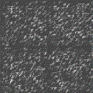

# Introduction to Generative Adversarial Network

The project aims to implement a simple Generation Adversarial Network (*GAN*): a deep learning model which generates images based on a training dataset.

***example here soon***

If there are a lot of other projects describing GAN's, I made this one to keep it simple, compatible with the latest versions of packages (Python3, Tensorflow 2, ... see the `requirements.txt` file) and easily editable.

This repository contains:
* the `generate.py` core program to train the model that generates images,
* a `create_gif.py` program to easily create animated gif of all the generated images,
* an `/assets` folder which contains a configuration file and other useful scripts.

Before running the program, install all needed packages with the command line:

```shell
$ pip install -r requirements.txt
```

## How to use

The user must firstly create a dataset of images based on which the GAN model will try to synthesize images.
Then, he can tweak some parameters in the `/assets/config.py` file: the learning rates and expected size of generated images.

To run the training process, use the command line:
```sh
$ python generate.py --dataset path/to/dataset
```
There are optional arguments which one can find using the command line:
```sh
$ python generate.py --help
```
Here are some useful options:
* `--epochs` and `--batch-size` to choose those training parameters, 
* `--grayscale` to convert images of the dataset to grayscale images,
* `--face-detection` to perform face cropping over all the dataset (slower).

Moreover, the user can choose to output intermediate generated images with the `--output-generated` argument, in which case an `output/generated` directory will be created. By default, 100 images will be exported, but the user can change this with the training function in the core script. The same goes for corresponding training data plots with the `--output-plots` argument.

## Visualize outputs

If intermediate images have been generated, one can create an animated gif to visualize this data, using the `create_gif.py` script with the command line:
```sh
$ python create_gif.py --output-generated path/to/generated/images
```

If the user wants to see the training plots and the generated images side by side, he can add the `--output-plots` optional argument.


## Edit the code

I tried to clear and document the code as much as I could so it would be understandable and editable. To modify the models, one can edit the `/assets/dcgan.py` file which contains all used neural networks.

In addition, the user can find the used functions and classes in the `/assets/tools.py` file, such as the dataset handler (to load and pre-process data) and the training handler.

## Constraints and limits

The size of generated images is constrained by the generator's model and must be a multiple of 80.
Also, this program can handle colored images, but the process being very slow I wasn't able to obtain satisfying data, so I recommand using the `-g` argument to convert dataset to graycale.

Finally, as one can see throughough examples in this README (and below), I never obtained "good" results with faces generation, but some are satisfying enough for me. 

<div style="text-align:center"></div>

# Credits

Based on this [tutorial](https://www.pyimagesearch.com/2020/11/16/gans-with-keras-and-tensorflow/).